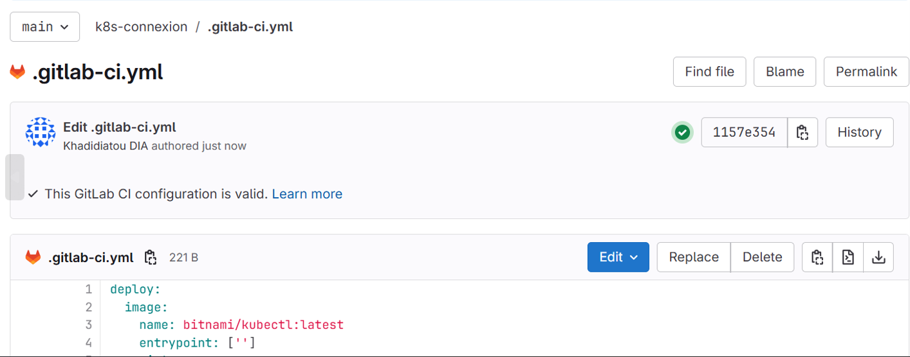
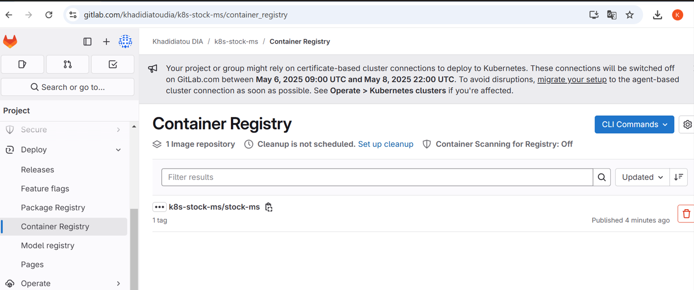

# 📌 Mise en place d'un Pipeline CI/CD avec Helm et GitLab

## 📚 Introduction
Ce guide explique comment automatiser le déploiement d'une application sur **Kubernetes** en utilisant **GitLab CI/CD** et **Helm**.

## 🎯 Objectif
- Construire et pousser une image Docker.
- Configurer un pipeline CI/CD sur GitLab.
- Déployer l'application sur Kubernetes via Helm.

---
## 🎯 Pourquoi utiliser Helm avec GitLab CI/CD ?
1️⃣ Helm facilite le déploiement sur Kubernetes 📦

Helm est un outil qui permet de gérer les applications Kubernetes sous forme de charts.
Plutôt que d'écrire plusieurs fichiers YAML à la main, Helm regroupe tout dans une seule configuration facile à modifier.

2️⃣ GitLab CI/CD automatise tout 🚀 <br>
Au lieu de faire le déploiement manuellement, GitLab CI/CD permet de tout exécuter automatiquement à chaque mise à jour du code.
Il suit ces étapes :
- Construire l’image Docker 🏗️
- L’envoyer dans un registre d’images Docker 📦
- Déployer automatiquement l’application sur Kubernetes avec Helm 🌐
---

## ✅ Quels sont les avantages ?
Automatisation complète :
👉 Dès qu’un développeur pousse une modification sur GitLab, tout le pipeline (build → test → déploiement) se fait sans intervention manuelle.

Facilite la gestion des configurations :
👉 Avec Helm, au lieu de modifier plusieurs fichiers YAML compliqués, on change juste quelques paramètres dans un fichier values.yaml.

Scalabilité et mises à jour simplifiées :
👉 Helm permet de mettre à jour une application facilement (upgrade) et de revenir en arrière (rollback) en un clic.
👉 Kubernetes gère la scalabilité, donc si ton appli doit gérer plus d’utilisateurs, Helm permet d’augmenter le nombre de copies (réplicas) sans effort.
---
## 🔥 Allez, un exemple concret ! Let's go 🚀
Imaginons que vous développiez une API de gestion de stock et que vous vouliez la déployer sur Kubernetes.

- Sans Helm : Vous devez écrire plusieurs fichiers YAML pour décrire comment déployer votre API, gérer les services, etc.
- Avec Helm : Vous définissez un Chart Helm et modifiez un seul fichier (values.yaml).
- Avec GitLab CI/CD : Dès que vous modifiez votre code : <br>
  1️⃣ GitLab CI/CD crée automatiquement une nouvelle image Docker. <br>
  2️⃣ Helm met à jour l’application sur Kubernetes. <br>
  3️⃣ L’API est en ligne avec la dernière version, sans coupure. <br>

🎯 C’est comme un robot qui fait tout le travail pour vous ! 🤖
---
## 🚀 Prérequis
- ✅ Compte **GitLab**
- ✅ **Docker** installé
- ✅ **Helm** installé
- ✅ **Minikube** installé

---

## 1. 🔧 Mise en Place de Clusters Kubernetes

### 1️⃣ Création du dépôt GitLab

1. Connectez-vous à votre compte GitLab.
2. Créer un **nouveau projet GitLab** pour votre application.
  
3. Ajouter un fichier `.gitlab-ci.yml` à la racine du projet.
   

### 2️⃣ Configuration du Cluster Kubernetes 

1. Dans l'onglet **Operate**, cliquez sur **Kubernetes clusters** pour créer une connexion au cluster.
  
2. Donnez un nom à votre cluster :
  
3. Générez les crédentiels pour la connexion :
 
⚠️ Une fois générées, copiez ces commandes et conservez-les avant de fermer la fenêtre. Cela vous permettra de vous connecter à votre cluster
 
5. Tapez les commandes suivantes dans Git Bash:

5. Accédez au tableau de bord Kubernetes pour visualiser l'état de vos déploiements:


6. Vous verrez également, au niveau du cluster, le statut de la connexion qui est établie.

7. Créer un fichier .gitlab-ci.yml pour le pipeline:

8. Vous devriez voir votre déploiement `k8s-connexion` affiché :

9. Vous verrez votre job aussi crée avec succès.


9. Visualisation en ligne de commande:

### ✔️ Vous constatez que la connexion entre GitLab et Kubernetes a été bien réussie.

## 2. 🔧 Étapes de mise en place : Prepare K8S Manifests and creation Charts Helm:
### Prepare Manifests:
#### Ce projet contiendra l'application stock-ms et déclenchera un pipeline qui va :
- Builder le projet
- Créer l’image Docker 
- Pousser l’image dans le Container Registry
1. Créer un projet

2. Créer un fichier .gitlab-ci.yml pour le pipeline:


3. Vous pouvez observer que les jobs ont été exécutés avec succès:


4. Vous verrez également l'image qui a été correctement poussée vers le container registry de gitlab.

### Creation Charts Helm
5. Lancez la commande de création de notre projet Helm en tapant la commande suivante:
 ```sh 
 helm create helm-stock-ms
 ```

6. Apres création de votre projet, éditez le fichier **values.yaml** qui se trouve dans le
répertoire **templates** . Par défaut c’est nginx, nous allons mettre le lien
vers notre image stocké dans le registry

7. Ensuite configurer vos fichiers **deployment.yaml** et **service.yaml**


⚠️NB : Lorsque vous lancez l'installation, cela échoue parce que vous n'êtes pas autorisé à accéder à l'image dans le registry

8. Vous allez créer votre secret, ce qui vous permettra d’accéder à votre image stockée dans le registre GitLab. Pour ce faire, suivez les étapes suivantes :
- Allez creer un token
- Vous allez utiliser maintenant cette commande :
 ```sh 
kubectl create secret docker-registry my-secret --dockerserver=<your-registry-server> --docker-username=<your-name> --
docker-password=<your-pword> --docker-email=<your-email>
 ```
 votre secret sera créé.
8. Lancez la commande pour visualiser en format .yaml les informations du secret. 
 ```sh 
kubectl get secrets my-secret -o yaml
 ```
 
- Vous pouvez le copier et le mettre dans notre fichier secret.yaml.

9. Et pour lancer les deploiements, on lance cette commande:

10. Visualiser le déploiement qui a été un succès


11. Vous pouvez voir les déploiements du namespace par défaut en ligne de commande en lançant les commandes ci-dessous :
- Cette commande vous permet d'afficher la liste des déploiements (Deployments) actifs dans le cluster Kubernetes :
```sh
    kubectl get deploy
 ```
- Cette commande vous permet d'afficher la liste des services Kubernetes dans le cluster :
 ```sh
    kubectl get services
```
12. Ensuite, vous allez exposer le service pour pouvoir le tester et obtenir l'URL d'accès au service `helm-stock-ms` exposé par Minikube. Utilisez la commande suivante :

 ```sh
    minikube service helm-stock-ms --url
```
Ou bien tapez la commande :

```sh
    minikube service helm-stock-ms --alsologtostderr
```

  
  

Vous pouvez ensuite vous rendre à l’adresse générée, et voilà, notre projet `stock-ms` est déployé avec succès. Vous pouvez observer sur l’image la documentation de l’API.


🚀 **Félicitations, ton déploiement est opérationnel !** 🎉
Tu as maintenant un pipeline CI/CD fonctionnel qui :
- Construit et pousse une image Docker.
- Déploie l'application sur Kubernetes via Helm.
- Automatise l'ensemble du processus avec GitLab CI/CD.


#### ✍️ Auteur : Khadidiatou DIA | 📩 sokhnakhadidjah@gmail.com"# k8s-helm" 
